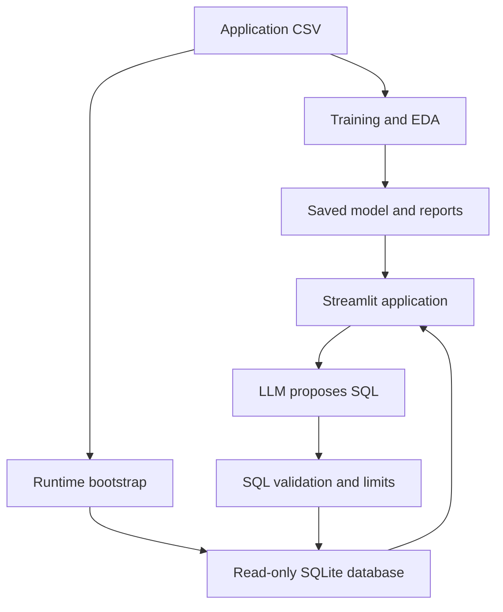

# CreditScope — Credit Risk Intelligence

CreditScope is my end-to-end credit-risk project for the NeoStats AI Engineer assignment, built with the Home Credit Default Risk dataset. It brings the complete workflow into one Streamlit application: data exploration, credit-risk prediction, local SHAP explanations, simplified decision rules, and a natural-language-to-SQL chatbot.

The model is trained and saved, all 13 automated tests pass, and I verified the complete application locally with Docker Compose. I also tested the Gemini integration with a live question and confirmed that it produced SQL, executed it, and displayed the result with token usage.

**Live application:** https://credit-risk-intelligence-platform-1.onrender.com

> The raw dataset is intentionally excluded from Git. Features that use the analytics database, particularly Talk to Data, require the CSV to be mounted privately. The complete workflow was tested locally and is shown in the presentation screenshots.

## Running the project with Docker

1. Download or clone the project and open the folder containing this README and `docker-compose.yml`.
2. Download `application_train.csv` from the [Home Credit competition page](https://www.kaggle.com/competitions/home-credit-default-risk/data) and place it at `data/application_train.csv`. The file used while developing this project has SHA-256 checksum `52e96b895b1112e1c853f670e58372719c8441c5ed1c57ac2f7fad559d784f5f`.
3. Copy `.env.example` to `.env`. To enable the live chatbot, add `LLM_API_KEY`, `LLM_MODEL`, and `LLM_BASE_URL` where required. The selected provider must support Chat Completions, JSON-object output, and `max_completion_tokens`. API keys should never be committed or included in screenshots.
4. Start Docker Desktop and run:

```sh
docker compose up --build
```

5. Open `http://localhost:8501`.

During the first startup, the container installs the required packages and converts the mounted CSV into a local SQLite database. The trained model is already part of the project, so the application does not retrain it during startup.

Docker Compose 2.24 or newer is recommended because the Compose file uses an optional environment-file declaration. To stop the project, press `Ctrl+C` and run:

```sh
docker compose down
```

If the CSV is missing, the saved reports and manual prediction screen still work, but the chatbot and held-out applicant examples are unavailable. If the API key is missing, the five reference SQL examples can still be used after the dataset is mounted; these are clearly marked as direct SQL examples.

## How the application is structured



The scoring model and chatbot are deliberately separate. The LLM only translates a business question into SQL; it does not calculate or assign an applicant's risk score. Predictions use the saved preprocessing, gradient-boosting, and calibration objects.

Proposed SQL first passes through a SQLGlot parser and allowlist. SQLite then applies read-only access, an authorizer, a timeout, and a row limit. The result is summarized locally from the rows returned by SQLite. This avoids a second LLM call and prevents the model from inventing numerical conclusions.

## Project structure

| Location | What it contains |
|---|---|
| `train.py` | EDA, dataset splitting, baseline and candidate training, calibration, rules, and evaluation |
| `src/data/preprocessor.py` | Reproducible feature engineering and separation of identifiers, inputs, and target |
| `src/ml/predict.py` | Probability prediction, score and band calculation, input checks, and permutation SHAP |
| `src/ml/rules.py` | Interpretable surrogate-rule generation |
| `src/talk_to_data/` | Prompt template, short conversation memory, API client, and guarded SQL execution |
| `bootstrap.py` | Converts the privately mounted CSV into SQLite and prepares held-out examples |
| `app.py` | The six Streamlit sections |
| `models/` | Saved final model, baseline, calibration objects, and rules |
| `reports/` | Metrics, EDA findings, feature catalogue, plots, and rule output |
| `tests/` | Model, SHAP, SQL-safety, memory, and UI tests |
| `documents/` | Presentation PDF, data guide, deployment notes, and validation notes |

## Data understanding and EDA

The application table has 307,511 rows and 122 columns: 106 numerical and 16 categorical columns, including the identifier and target. There are 24,825 positive cases, which gives a positive rate of 8.07%. In the source data, `TARGET=1` means the applicant experienced payment difficulty after a delay in the early instalments. I therefore describe the outcome as *payment difficulty* rather than treating it as a universal legal definition of default. The source also does not specify a currency, so amounts are labelled as dataset units.

EDA is based on 261,384 development rows, with the final test split kept separate. The six findings in `reports/eda.json` cover income type, education, housing, contract type, age, and credit-to-income ratio. Every finding includes the group size, observed rate, a comparison group, and a chart. Rankings ignore groups with fewer than 500 applicants to avoid highlighting very small segments.

Some housing-related columns have very high missingness. Another important issue is `DAYS_EMPLOYED=365243`, which is a sentinel value rather than a genuine employment duration. The pipeline replaces it with missing data and adds an indicator. Numeric medians and categorical encoders are learned only from the training rows. Unknown categories are supported, invalid ratios become missing instead of infinite, and neither `TARGET` nor `SK_ID_CURR` is used as a model feature.

Only the application table and column description were supplied for this build. As a result, the project does not claim to analyse detailed bureau history, previous applications, or instalment-level repayment behaviour. Adding those tables would be the most useful next data improvement.

## Model approach and results

The model starts with 35 raw inputs and creates features such as age, employment duration, credit-to-income ratio, annuity-to-income ratio, and mean external score. I selected histogram gradient boosting because it is compact, works well on nonlinear tabular relationships, and remains practical on a CPU. A class-balanced logistic regression is included as a simpler baseline.

Two boosting candidates—with and without balanced class weights—were trained. Both were calibrated using sigmoid calibration on a separate calibration set. Validation average precision was used to select the balanced version.

| Split | Rows | Purpose |
|---|---:|---|
| Training | 169,130 | Fit preprocessing and models |
| Calibration | 46,127 | Calibrate predicted probabilities |
| Validation | 46,127 | Select the model, threshold, and bands |
| Test | 46,127 | Report final performance |

The splits are stratified and use seeds 42, 43, and 44. Gradient boosting also uses early stopping within the training allocation. This is a random holdout design, not temporal or external validation.

| Final test metric | Result |
|---|---:|
| ROC-AUC | 0.7616 |
| Average precision | 0.2438 |
| Positive prevalence / no-skill AP | 0.0807 |
| Precision at threshold 0.08 | 0.1650 |
| Recall at threshold 0.08 | 0.7019 |
| F1 | 0.2672 |
| F2 | 0.4252 |
| Brier score | 0.06777 |

The final test confusion matrix is TN=29,178, FP=13,225, FN=1,110, and TP=2,614. The threshold was chosen by maximizing validation F2, giving recall more importance than precision because no business cost matrix was provided. This produces many false positives, so it should be viewed as an experimental screening threshold rather than a real lending cutoff.

Calibration reduced the test Brier score from 0.19073 to 0.06777. On validation data, the logistic baseline achieved ROC-AUC 0.7475 and average precision 0.2274, while the selected model reached 0.7583 and 0.2420.

The displayed risk score is simply the calibrated probability multiplied by 100. Validation quantiles produce three relative bands:

- Low: below 5.1994%
- Medium: 5.1994% to below 15.2470%
- High: 15.2470% or above

These bands provide relative risk groupings. They are not approved credit policy and are separate from the binary screening threshold.

## Explainability and readable rules

Each prediction is explained using permutation SHAP on the complete calibrated pipeline. The explanation is measured in probability units and uses a median/mode reference created from 1,000 training rows. No raw training applicants are stored inside the model artifact. The implementation checks that the baseline plus the feature contributions reconstructs the actual predicted probability, then displays the ten largest contributions as percentage points.

I initially tested native categorical-tree conversions, but they did not reproduce the calibrated prediction closely enough. I therefore used model-agnostic permutation SHAP so the explanation matches the model that actually serves the prediction. These explanations remain approximate: correlated variables may share importance, and masked combinations are not always realistic. They explain the model's calculation, not the cause of a person's repayment difficulty.

For simpler business-readable rules, a depth-three decision tree learns to approximate the final model's Low, Medium, and High bands using five interpretable features. It agrees with the model bands on 74.73% of validation rows. Rounded examples include:

- Mean external score at or below 0.34 and age at or below 56.35 → High
- Mean external score between 0.34 and 0.53 → Medium
- Mean external score above 0.53 → Low

The complete fitted tree in `reports/rules.json` is authoritative. These rules are an approximation of the model, not a replacement for it or a loan-approval policy.

## Talk to Data design

The chatbot prompt defines the available schema, the exact meaning of the target, permitted columns, and SQL restrictions. Descriptive questions default to development rows so the test set is not casually explored. Questions requiring unavailable repayment or bureau history should return a clarification rather than fabricated SQL.

Five reference patterns are included: overall difficulty rate, rate by income type, average credit among positive cases, rate by age decade, and highest-rate occupations with a minimum group size.

To keep the prompt small, only the latest three question-and-SQL pairs are sent back to the provider. The interface retains ten turns and lets the user clear them. Questions are limited to 1,000 characters, responses to 700 completion tokens, and each question uses one generation call. Provider token usage is shown in the interface.

The validator allows one `SELECT` statement against the approved `applicants` table. It checks table and column names, restricts functions, and rejects joins, CTEs, nested queries, mutations, system tables, offsets, and unrestricted wildcard output. Results are capped at 100 rows, and SQLite independently applies read-only access and a two-second execution limit. The proposed SQL and returned rows stay visible so the answer can be audited.

These safeguards stop many unsafe or unsupported requests, but syntactically valid SQL can still misunderstand a question. That is why the five live evaluation questions are checked individually rather than claiming perfect reliability.

## Running and testing without Docker

With Python 3.12 and a virtual environment:

```sh
python -m pip install -r requirements.txt
python bootstrap.py
python -m streamlit run app.py
```

After mounting the data, run the tests with:

```sh
python -m unittest discover -s tests -v
```

To retrain the models and regenerate reports:

```sh
python train.py --data data/application_train.csv
```

Retraining overwrites the saved model and report files, so the application should be restarted afterward to clear cached resources.

After configuring the LLM environment variables, the live chatbot evaluation can be run with:

```sh
python evaluate_live_chat.py
```

This command makes five real API calls and saves their SQL, returned rows, and comparison results in `reports/live_chat_evaluation.json`. The API calls may be billable depending on the provider.

## Deployment

The repository includes both `Dockerfile` and `docker-compose.yml`. An evaluator can provide the dataset and private environment variables, then start the application with one command:

```sh
docker compose up --build
```

The public application is hosted on Render:

https://credit-risk-intelligence-platform-1.onrender.com

The raw CSV and API secrets are intentionally excluded from Git and the submission ZIP. A production deployment would mount the data privately on a container host with writable storage, sufficient memory, and WebSocket support. A static-site service would not be suitable for this application.

## Current limitations and next steps

- The current model uses application data only. Bureau, balance, previous-application, and instalment tables would need leakage-aware aggregation before they could be added.
- The model search is intentionally small, and the model has not yet been tested with confidence intervals, temporal validation, external validation, fairness evaluation, or drift monitoring.
- Manual scenarios with many missing inputs depend strongly on imputation; the interface warns the user when this happens.
- Applicant attributes may introduce fairness concerns. Removing one sensitive field would not be enough to establish fairness.
- SQLite and in-process usage limits are suitable for this project. A production system would need authentication, centralized rate limits, audit retention, monitoring, and controlled data access.
- Saved `joblib` files should only be loaded from a trusted source and with compatible package versions.
