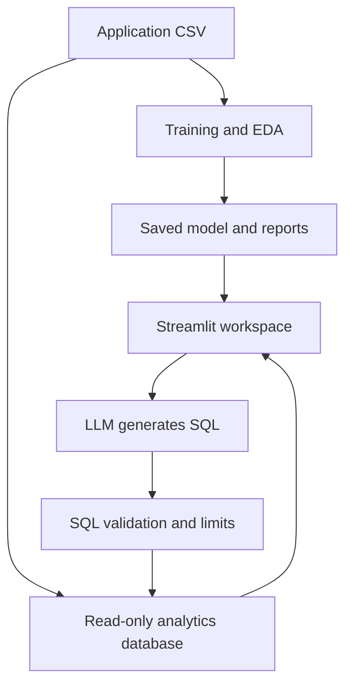

# CreditScope — Credit Risk Intelligence

A NeoStats AI Engineer candidate project using Home Credit application data. The six-section Streamlit app connects exploratory analysis, calibrated repayment-difficulty predictions, local SHAP explanations, a compact rule surrogate, and an LLM-to-SQL interface.

**Status:** model trained; 13 automated tests passed; Docker Compose was verified healthy on the candidate's laptop; and a live Gemini-to-SQL question executed successfully with visible SQL, results and token usage. Public deployment remains required before submission. No deployed URL is claimed.

## Run with Docker Desktop

1. Extract the project and open its folder in a terminal. The folder must contain this README and `docker-compose.yml`.
2. Obtain `application_train.csv` from the [Home Credit dataset](https://www.kaggle.com/competitions/home-credit-default-risk/data), respecting its access terms. Put it in `data/application_train.csv`. The exact file supplied for this build has SHA-256 `52e96b895b1112e1c853f670e58372719c8441c5ed1c57ac2f7fad559d784f5f`.
3. Copy `.env.example` to `.env`. For live chat, privately fill `LLM_API_KEY`, `LLM_MODEL`, and, if needed, `LLM_BASE_URL`. Use a model supporting Chat Completions, JSON object output and `max_completion_tokens`. The default endpoint is OpenAI; provider API access is required separately. Never put a key in source control or screenshots.
4. Start Docker Desktop, then run:

```sh
docker compose up --build
```

5. Open `http://localhost:8501`. First startup installs dependencies and converts the locally mounted CSV to SQLite. The trained model is already included; startup does not retrain it.

Use Docker Compose 2.24 or later (`docker compose version`), because the environment file is optional in the Compose specification used here. Stop with Ctrl+C, then `docker compose down`. If the dataset is absent, reports and manual prediction remain available, while data chat and held-out examples remain unavailable. If the API key is absent, SQL examples work after the dataset is mounted and remain explicitly labelled as non-AI demonstrations.

## Architecture



The LLM proposes queries; it never assigns credit scores. Inference uses the saved preprocessing, boosting and calibration objects. SQL is checked twice: a SQLGlot syntax/allowlist layer followed by SQLite read-only access, an authorizer, a timeout and output limits. A deterministic renderer summarizes the actual result rows, so no second LLM call can invent a numerical answer.

## Project map

| Location | Purpose |
|---|---|
| `train.py` | Reproducible EDA, splits, baseline/candidates, calibration, rules, evaluation |
| `src/data/preprocessor.py` | Deterministic features; input/target separation |
| `src/ml/predict.py` | Probability, score, bands, input checks, permutation SHAP |
| `src/talk_to_data/` | Prompt, bounded history, real API client, SQL validation/execution |
| `bootstrap.py` | Private CSV → SQLite and held-out demonstration profiles |
| `app.py` | Overview, Explore data, Risk assessment, Model evidence, Rules, Talk to data |
| `models/` | Saved final model bundle and logistic baseline |
| `reports/` | Machine-readable metrics, six EDA findings, quality catalog, figures, rules |
| `notebooks/` | Reproducible analysis walkthrough |
| `tests/` | Model, SHAP, SQL safety, memory contract and app functional checks |
| `documents/` | Final presentation PDF with verified application screenshots and supporting documentation |

## Data and EDA

The supplied table contains 307,511 applications and 122 columns: 106 numeric and 16 categorical, including the target and identifier. There are 24,825 positive outcomes (8.07%). TARGET describes payment difficulties beyond an unspecified delay in early installments; it is not a universal legal definition of default. Amounts are shown in dataset units because the supplied schema does not establish a currency.

EDA uses 261,384 development rows, excluding the final test set. `reports/eda.json` contains six quantified, non-causal comparisons, each with sample counts and a corresponding chart: income type, education, housing, contract type, age group and credit/income ratio. Rate rankings exclude groups with fewer than 500 applications. `reports/feature_catalog.json` covers every source column; `documents/DATA_GUIDE.md` explains business categories and coverage.

Several housing-description fields are mostly missing. DAYS_EMPLOYED=365243 is a sentinel, not a real employment duration. It becomes missing with an indicator. Numeric medians and encoders are learned only from model-training rows. Unknown categories are supported. Invalid denominators become missing rather than infinite. TARGET and SK_ID_CURR never enter model features.

Only `application_train.csv` and the dictionary were supplied. Bureau-query counts, external scores and social-circle indicators provide limited credit-related information. Detailed bureau history, prior applications and installment repayment behavior are **not** analyzed without the additional source tables; their absence is disclosed in the UI. Those are the highest-priority data extensions.

## Model design and measured results

The model uses 35 raw inputs plus deterministic features such as age, employment years, credit/income, annuity/income and mean external score. Histogram gradient boosting is a small CPU-friendly choice for nonlinear tabular data and native categorical splits. A class-balanced logistic regression provides a simpler comparison. Two boosting candidates, with and without class weights, are fitted. Each receives sigmoid calibration on separate calibration data. Validation average precision selects the balanced model.

| Split | Rows | Use |
|---|---:|---|
| Training | 169,130 | Learned transforms and model fit |
| Calibration | 46,127 | Probability calibration |
| Validation | 46,127 | Candidate selection, threshold and bands |
| Test | 46,127 | Final reported metrics |

Stratified random splitting uses seeds 42, 43 and 44. Gradient boosting also uses internal early stopping within the training allocation. This is not temporal or external validation.

| Final test measure | Value |
|---|---:|
| ROC-AUC | 0.7616 |
| Average precision (PR summary) | 0.2438 |
| Positive prevalence / no-skill AP | 0.0807 |
| Precision at 0.08 | 0.1650 |
| Recall at 0.08 | 0.7019 |
| F1 | 0.2672 |
| F2 | 0.4252 |
| Brier score | 0.06777 |

The test confusion matrix is TN=29,178, FP=13,225, FN=1,110, TP=2,614. Many flagged applications are false positives. The threshold maximizes validation F2, weighting recall more strongly, because no business loss function was supplied. It is a demonstration screening threshold, not a recommended lending cutoff. Uncalibrated test Brier was 0.19073; separate calibration materially improves probability accuracy. The logistic baseline's validation ROC-AUC/AP are 0.7475/0.2274, versus 0.7583/0.2420 for the selected model. Baseline threshold metrics and Brier are not calibration-matched comparisons.

The **risk score is probability × 100**, with higher values meaning higher estimated difficulty risk. Validation quantiles define Low <5.1994%, Medium 5.1994%–<15.2470%, and High ≥15.2470%. These bands and the binary screening threshold serve different purposes. Bands are relative demonstration segments, not lender-approved policy.

## Explainability and rules

Permutation SHAP explains the complete calibrated pipeline in probability units. It uses a median/mode reference summarized from 1,000 training rows; it does not embed raw training applicants in the model artifact. With a fixed seed and three permutation-budget cycles, the baseline plus all contributions is checked against the actual predicted probability. The UI displays the top ten contributions in percentage points. Correlated features can share attribution and masking may produce unrealistic combinations. These are approximate model explanations, not causal claims.

Native categorical tree conversions did not reproduce the calibrated prediction in an initial explainability check, so model-agnostic permutation SHAP was chosen. The reconstruction test protects against explaining a different mathematical model from the one serving predictions.

A depth-three decision tree learns the final model's training-set bands using five interpretable features. Its validation agreement is **74.73%**. The tree is saved in the final bundle and its output is in `reports/rules.json`. Approximate readable examples (thresholds rounded):

- Mean external score ≤0.34 and age ≤56.35 → the surrogate assigns High risk.
- Mean external score between 0.34 and 0.53 → the surrogate assigns Medium risk.
- Mean external score >0.53 → the surrogate assigns Low risk.

These examples summarize surrogate leaves; the exact fitted tree is authoritative. Missing values follow the saved rule imputer. The rules do not replace the full model and are not loan approval policy.

## LLM prompting, memory and hallucination controls

`prompt_templates.py` supplies one schema-specific system prompt, the exact target meaning, available columns and SQL constraints. It defaults to development rows, avoiding accidental holdout exploration. Unsupported repayment-history questions should receive a clarification. Five explicit query patterns cover aggregate risk, income groups, positive-case loan amounts, age bands and occupation ranking with a minimum group size.

Only the latest three question/SQL pairs enter provider context; UI history retains ten turns and can be cleared. Questions are capped at 1,000 characters and output at 700 completion tokens. One generation call per question, local result rendering and schema-only context reduce token use. Provider-reported usage is displayed. There is a configurable in-process hourly request budget and a short UI cooldown; these are demo safeguards, not distributed production rate limiting.

The SQL validator accepts one SELECT on one allowed table, known columns and approved aggregate/numeric functions; it rejects joins, nested queries, CTEs, mutations, system tables and unbounded wildcard selection. Result limits cannot exceed 100. SQLite adds a 2-second execution budget and independent authorization. SQL and result rows are visible for audit. Syntax validation cannot prove that a semantically valid SQL query answers the user's intended question, so live question-by-question checks remain necessary.

The provider receives schema, user question and bounded history, not applicant result rows. It is still the user's responsibility not to type private information into a question. Provider errors are reported explicitly; there is no canned-response substitute presented as live AI.

## Reproduce and test without Docker

Use Python 3.12 in a virtual environment, then:

```sh
python -m pip install -r requirements.txt
python bootstrap.py
python -m streamlit run app.py
```

With data mounted, run:

```sh
python -m unittest discover -s tests -v
python train.py --data data/application_train.csv
```

The second command retrains and overwrites generated reports/models. Restart the app after retraining to clear its resource cache. To check real AI calls after configuring `.env`, run:

```sh
python evaluate_live_chat.py
```

This deliberately makes five billable API calls and records returned SQL, rows and comparison results in `reports/live_chat_evaluation.json`. Run it only when ready to evaluate your configured provider. Offline mocked API tests establish the request contract and memory behavior; they do not establish live model reliability.

## Public deployment

The updated submission instruction requires a deployed project URL as well as Docker and Compose files. A localhost address is not that URL. See `documents/DEPLOYMENT.md` for container requirements and checks. Keep raw data and secrets out of Git/ZIP; provision the CSV privately on the host. This Python/SQLite/SHAP app needs a host that runs Docker containers with writable disk, enough RAM and WebSocket support. A static site host is insufficient.

## Limits and next improvements

- Application-only scope; add and aggregate bureau, balance and installment tables with leakage-aware joins before claiming credit-history/repayment coverage.
- Small candidate search; no confidence intervals, temporal holdout, external validation, fairness assessment or drift monitoring yet.
- Sparse manual inputs rely heavily on imputation; the UI warns about incomplete scenarios.
- Age and other applicant attributes can produce fairness issues; excluding a single sensitive column does not establish fairness.
- SQLite and in-process budgets suit a demonstration; production needs authenticated roles, centralized budgets, audit retention and operational monitoring.
- Saved joblib files must come from trusted sources. Artifacts are tied to the recorded library versions.
- Live LLM, real Docker startup and public hosting are explicit remaining verification gates.
